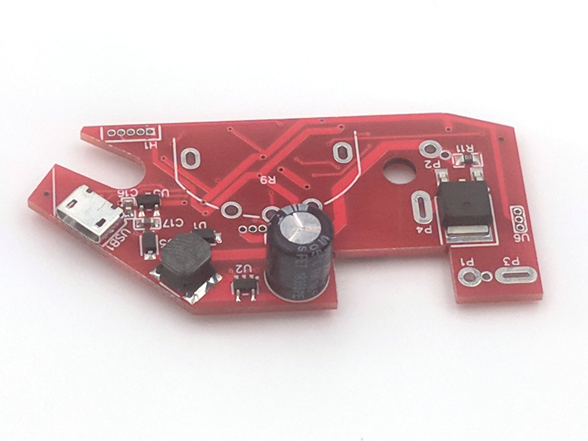
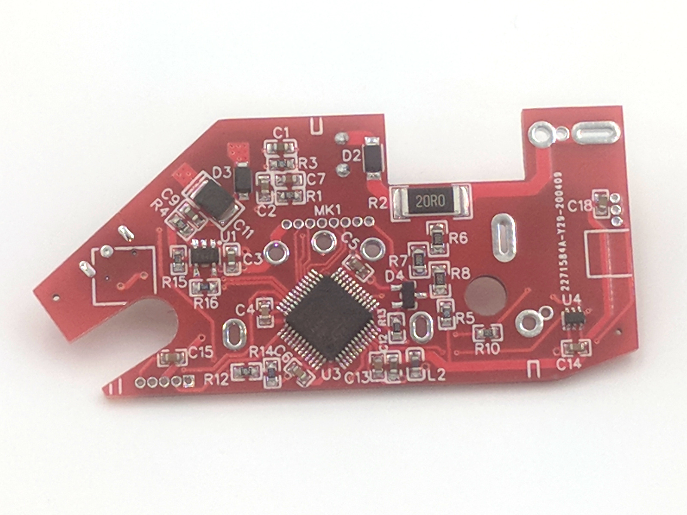

Device assembly <!-- omit in toc -->
===============

- [Required components](#required-components)
- [Extract some parts from original board](#extract-some-parts-from-original-board)
- [Solder PCB top and bottom](#solder-pcb-top-and-bottom)
- [Cleanup PCB](#cleanup-pcb)
- [Install the rest and attach wires](#install-the-rest-and-attach-wires)
- [Upload firmware and test](#upload-firmware-and-test)
- [Cover PCB with protective coating](#cover-pcb-with-protective-coating)
- [Firmware tune](#firmware-tune)

## Required components

&nbsp; | Name | Comment
-----|-------------|--------
1 | [Hilda 180W](https://www.aliexpress.com/af/hilda-180w.html?SortType=total_tranpro_desc) grinder | Such grinders are available under other labels. Any, exactly as on photos below, will be ok.
2 | [PCB & Components](https://easyeda.com/speed/AC-speed-control-for-grinder) | Go to EasyEda project page and order both in couple of clicks. If you order PCB first, components second, then you will be able to join delivery and save some bucks.
3 | PCB protective coating | [Plastik 70 CRC](https://www.google.com/search?q=Plastik+70+CRC) or any other acrylic [insulating lacquer](https://www.google.com/search?q=insulating+lacquer).
4 | [Male](https://www.aliexpress.com/item/-/32700932502.html) & [female](https://www.aliexpress.com/item/-/32593170276.html) 2.8x0.5mm power terminals | Optional. You can solder power wires directly.
5 | [22 AWG wire](https://www.aliexpress.com/item/32854919883.html) | Stainless steel, for SMT stencil only. Position over PCB, via reference holes.

Note, if you have soldering air gun, it's good idea to order SMT stencil to
simplify assembly. Select custom stencil size 100*100mm for cheap delivery.

**Optional parts**

Those may be required only for development, adding "lab stand" features - hall
tacho, wireless logger, SWD debug.

&nbsp; | Name | Comment
-----|-------------|--------
1 | [Hall sensor](https://lcsc.com/product-detail/Magnetic-Sensors_HX-hengjiaxing-HX4913_C296270.html) | Tacho.
2 | [Magnetic resin](https://www.aliexpress.com/item/33017302814.html) | Do magnetic mark for hall sensor.
3 | [Magnetic field viewer](https://www.aliexpress.com/item/32967659973.html) |
4 | [RF sender](https://lcsc.com/product-detail/Wireless-Modules_nRF24L01-wireless-module_C84802.html) | Logs transmitter. Note, similar modules from AliExpress have dofferent power pinout.
5 | [RF receiver](https://www.aliexpress.com/item/4000112750588.html) | Logs receiver.
6 | [1.27mm 8 pin female conn](https://lcsc.com/product-detail/Pin-Header-Female-Header_BOOMELE-Boom-Precision-Elec-C92297_C92297.html) |
7 | [1.27mm male pins](https://lcsc.com/product-detail/Pin-Header-Female-Header_BOOMELE-Boom-Precision-Elec-1-27mm-1x50P_C3408.html) |
8 | [1.27mm pogo pins clip](https://www.aliexpress.com/item/32959606674.html) | SWD debug.
9 | [Cheap ST-link/V2 programmer](https://www.aliexpress.com/af/st-link-v2.html?SortType=total_tranpro_desc) | For hardware debug. You can also order it at [LCSC](https://lcsc.com/search?q=st-link) with other components.
10 | [USB isolator](https://www.aliexpress.com/af/usb-isolator.html) | MUST be used with ST-Link/V2.

## Extract some parts from original board

You need:

- Potentiometer.
- Motor terminals.
- Filter capacitor (0.1uF 275v, attached in parallel to power).

## Solder PCB top and bottom

We recommend to install all components, except regulating knob. Because on
flux cleanup phase, some solvents can wash off speed marks.

PCB top:

PCB bottom:

## Cleanup PCB

You should remove the rest of flux, to add protective coating later. Methods and
solvents are not commented. We hope, if you use flux, you know how to remove it.

## Install the rest and attach wires

Now you can install potentiometer, filtering capacitor, and check everything
fits into case. Don't forget to remove flux again.

PCB with speed knob & filter capacitor:

PCB in drill body:

## Upload firmware and test

**WARNING! You MUST unplug power cord prior to firmware upload.** Turning power
off via grinder switch is not enough. If you plug programmer into computer
while AC plug in power socket, your USB interface may be damaged!

1. Install [VS Code](https://code.visualstudio.com/).
2. Clone this repo or download as zip archive and unpack somewhere.
3. Open folder with project AND after VS Code suggests to install plugins - agree
   with everything. That should install PlatformIO and all required dependencies.
4. Make sure you installed & configured ST-link/V2 drivers:
   - [Linux](http://docs.platformio.org/en/latest/installation.html#troubleshooting)
     instructions (how to configure `udev` rules).
   - [Windows](https://www.st.com/en/development-tools/stsw-link009.html) drivers.
5. Attach ST-link/V2 with 4 wires, named as `VCC`, `SWCLK`, `GND`, `SWDIO`.
6. Run via VS Code menu: `Terminal` → `Run Task...` → `PlatformIO: Upload`,
   and wait until complete.

Now you can assemble drill, run self-calibration and try how your "new drill"
works.

**IMPORTANT**. When you turn device on after firmware upload, motor will run at
slow speed and will not react on knob. That means, motor calibration required
(it's done only once, don't worry).

To run calibration:

- Move knob to zero.
- Move knob shortly up-and-down 3 times (in 3 seconds).
- Wait couple of minutes until magic finishes and motor stops. Be patient.

If everything works as needed, you can go to final step - protect PCB from dust.

## Cover PCB with protective coating

When you work, drill is actively cooled with air flow. Produced dust can be
partially absorbed and cause regulator damage. It's strongly recommended to
shield PCB with protective coating.

**Warning!** Coating should be done after you are 100% sure everything
works as expected. You will not be able to solder PCB after that.

Prior to apply coating, don't forget to clean PCB with isopropyl alcohol or
acetone. That's important for good adhesion.

You can use special PCB coatings or alternatives. See below.

### Special PCB coatings <!-- omit in toc -->

Such products are "officially" declared as suitable for PCB protection. This
can be spray like [Plastik 70 CRC](https://www.google.com/search?q=Plastik+70+CRC),
acrylic [insulating lacquer](https://www.google.com/search?q=insulating+lacquer),
or something else.

If your coater is spray - put it to pepsi cap first and use cosmetic brush to
cover PCB. Don't apply spray directly, because you need to keep terminals and
knob internals clean.

Usually, lacquers need 3-5 layers for best result.

Note, a lot of ordinary lacquers from your local shop can be ok. BUT,
some may have not suitable electric resistance. Don't use untested things, if
you are not 100% sure. See more safe alternatives below.

### Alternate protection <!-- omit in toc -->

If you have no special PCB chemistry, it may be more convenient to find
alternate & more cheap materials in your local shop.

**RTV1 non-corrosive silicon glues:**

- [RTV704](https://aliexpress.com/af/704-silicone-glue.html)
- [RTV705](https://aliexpress.com/af/705-silicone-glue.html)

IMPORTANT! You should not use any random silicone glue, because those can
contain acid. Advised glues were tested and are neutral.

Disadvantage: all silicone glues need 1 day to dry.

**UV gels for nails**

Those have more weak adhesion to PCB, than previous recipes. But this method may
be more simple/accessible for you. At least, that's better than nothing :).

NOTE. You should NOT use any random gel!

- It should have good adhesion to PCB.
- It should be "top coating" (good durability).
- It should be marked as "soak off" / "no wipe" and so on.

After testing adhesion of different samples, those look nice:

- [MIZHSE Rubber Top Coat](https://www.aliexpress.com/item/32922287804.html) -
  preferable.
- [UR SUGAR Top Coat](https://www.aliexpress.com/item/32948364351.html) - may
  be more viscous than desired for comfortable work.

Make sure to clean PCB with IPA prior to apply gel.

Disadvantage: average adhesion, not tested in long term (months and years).

## Firmware tune

By default, auto-tune tries to do the best, and you should not need manual
modifications. But, there are some rare cases, when you may wish to change
defaults:

1. If grinder "oscillates" in some modes - reduce [`PID_SAFETY_SCALE`](https://github.com/speedcontrols/ac_sc_grinder/blob/24eba36e3c3c48c03d976829382f7f6ada63cc11/src/calibrator/calibrator_pid.h#L15)
   to `0.5`.
2. If you wish to enable back integral component of regulator - comment out
   [`-DNO_PID_I`](https://github.com/speedcontrols/ac_sc_grinder/blob/24eba36e3c3c48c03d976829382f7f6ada63cc11/platformio.ini#L21)
   line in config.

## The end :) <!-- omit in toc -->

Enjoy!
